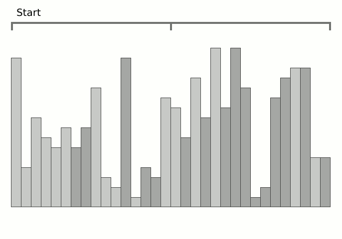

Вариант №4: задание с пузырьковой ("bubblesort") сортировкой;
### **Выполнение задания**

Начнём с ведения, а также упоминания будущего алгоритма сортировки, идеальный алгоритм сортировки соответствует следующим идейным параметрам:

- **Стабильность:** равные значения не перемещаются;
- Работают в рамках одного пространства, требуя $\textbf{O(1)}$ дополнительной памяти;
- Худший случай сравнений равен $\textbf{O(n}\ \times \textbf{lgn)}$ комплексности;
- Худший случай перестановки равен $\textbf{O(n)}$ комплексности в рамках оной;
- **Адаптивность:** стремится к скорости $\textbf{O(n)}$, когда данные почти отсортированы или когда мало уникальных ключей в данных;

> [!Caution]
> Не существует такого алгоритма, который удолетворяет всем вышесказанным условиям, потому выбор алгоритма сортировки зависит от контекста применения.

Мы должны понимать, что нативная сортировка C# (.NET) всегда будет быстрее чем любая собственная интерпретация в данном задании (Array.Sort в .NET использует гибридную TimSort/IntroSort сортировку на low-level C# интерпретации). В нашем же случае, мы будем использовать уникальную и, в некотором плане, нишевую сортировку — block sort или же block merge sort (иногда также известна как "grailsort"). 

> [!Tip]
> Блоковая сортировка — это гибридный алгоритм, основанный на идеях слияния ("mergesort"), но с использованием буферов и блоков для минимизации перемещений. Он оптимизирован для работы "in-place" т.е. почти не использует дополнительную память.

Наша проектная реализация будет написана на .NET 9 (C# 18). Произведём небольшое архитектурное введение в наш проект:

1. Будет существовать отдельная директория для алгоритмов сортировки, под таким же наименованием $-$ `Algorithm` и в ней будут находится классы-файлы этих алгоритмов сортировки в следующем формате: `ExampleNameAlgorithm`;
2. Мы создадим отдельный метод для тестов с использованием встроенного счётчика времени C# `Stopwatch`, будут следующие выборки данных:
	   - массив с 10 значениями: диапазон от \[0-10);
	   - массив с 10000 значениями: диапазон от \[0-10000);
	   - массив с 1'000'000 значениями: диапазон от \[0-1'000'000);
3. Мы будем тестировать 3 алгоритма сортировки между собою:
	   - алгоритм блоковой сортировки;
	   - нативный алгоритм C#;
	   - алгоритм пузырьковой сортировки;

Программную реализацию можно увидеть на репозитории:
<https://github.com/angelomira/Refactoring.NET/tree/deps/rc02>

Вывод в консоль при выполнении программы выглядит следующим образом:

| Вид алгоритма/размер массива | $N=10$ | $N=10000$ | $N=1000000$ |
| ---------------------------- | ------ | --------- | ----------- |
| Блоковая сортировка          | 0ms    | 40ms      | 992ms       |
| Нативная сортировка C#       | 0ms    | 5ms       | 75ms        |
| Пузырьковая сортировка       | 0ms    | 38097ms   | -           |

Если провести визуализацию разности комплексностей графиков, то она будет выглядеть следующим образом:

Примерный анализ времязатрат на итерации с размером массива по возрастающей (в оси используются миллисекунды):

